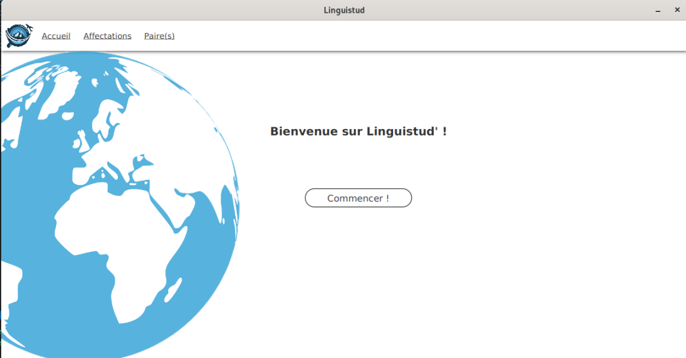

# Organisation de séjours linguistiques
## SAE S2.02 - Compte rendu pour la ressource IHM

*De Gaël DIERYNCK, Romain HARLAUT, Amaury VANHOUTTE*
*Groupe A - A1-2025*

Page d’accueil de l'application final

---

lien mockup : https://www.figma.com/design/nLEKdzubF5vRLznHhmxhv2/Paper-Wireframe-Kit--Community-?node-id=7574-1023&t=HFqADpN6LtqUxSxi-1

---

# Choix de conception

Linguistud' est une application qui vise a être utilise pour les échanges linguistique.

#### 1. **Guidage**

L'application utilise une barre de navigation fixe (toolbar) composée de plusieurs onglets clairement identifiés : "Accueil", "Affectations" et "Paire(s)".

Chaque onglet porte un nom explicite qui reflète précisément sa fonction dans l'application, ce qui permet à l’utilisateur de comprendre immédiatement à quoi correspond chaque section.

De la même manière, tous les boutons présents dans l’interface sont nommés de façon à indiquer clairement l’action qu’ils déclenchent une fois cliqué, ce qui renforce le guidage global et évite toute ambiguïté.
 
#### 2. **Charge de travail**
L’interface a été conçue pour limiter au maximum la quantité d’actions à effectuer. 

Par exemple,on peut crée automatique les paires ou les crée manuellement.

Pour cela, il suffit de sélectionner deux profils dans une liste, sans avoir à saisir manuellement leurs informations.

#### 3. **Contrôle explicite**
Les actions dans l'application ne se déclenchent que lorsque l’utilisateur le décide.

Pour la création d’une paire ne devient possible que lorsque deux adolescents sont sélectionnés, ce qui empêche toute erreur ou automatisme non voulu.

#### 4. **Adaptabilité**
L'application peut être utilisée dans plusieurs contextes. Les informations sont faciles à lire.

#### 5. **Compatibilité**
L'application reprend des éléments familiers comme les listes et les boutons.

Cela aide les utilisateurs à comprendre rapidement comment l'utiliser, surtout s'ils ont déjà utilisé d'autres outils numériques similaires.

#### 6. **Homogénéité / Cohérence*
Toutes les pages de l’application partagent une même charte visuelle : mêmes couleurs, mêmes styles de boutons, même structure générale. 

Cela renforce la cohérence globale et permet de passer d’un écran à un autre sans rupture. Les interactions fonctionnent selon les mêmes logiques sur toutes les pages.

#### 7. **Signifiance des codes**
Les icônes et les textes utilisés sont simples et explicites. 

Les fonction des boutons sont clairement identifiables, et les messages affichés lors des actions sont courts, clairs et sans ambiguïté.

#### 8. **Gestion des erreurs**
L'application a été pensée pour limiter au maximum les erreurs utilisateur et en faciliter la correction. 

Les champs obligatoires sont clairement identifiés et ne peuvent pas être laissés vides sans provoquer un retour visuel.

Comme lorsqu’un utilisateur tente de lancer une recherche sans avoir sélectionné deux adolescents le bouton pour crée la pair n’apparaît pas et l’interface indique qu’il manque un ou deux adolescents. 

# Contribution de chacun

Le travail a été réparti selon les compétences et les expériences de chacun afin d'assurer une progression efficace et complémentaire du projet.

- **Romain** s’est principalement occupé du prototypage de l’interface. Il a d’abord conçu les maquettes basse fidélité sur Figma qui ont permis de structurer les écrans de manière logique et fonctionnelle. Ensuite, il a travaillé sur la rédaction du rapport.

- **Amaury**, ayant déjà une expérience préalable sur Scene Builder grâce à un précédent projet, a pris une part active dans la conception du prototype haute fidélité. Ensuite, il s’est chargé de la création de l’interface graphique avec JavaFX, en s’appuyant directement sur les prototypes.

- **Gaël**, de son côté qui avait une expérience préalable , a intégré toute la logique fonctionnelle de l’application en implémentant le code Java à l’interface développée par Amaury.

---

lien video: "https://gitlab.univ-lille.fr/sae2.01-2.02/2025/A1/-/blob/main/renduIHM/video/videoPROCESSED.mp4"

