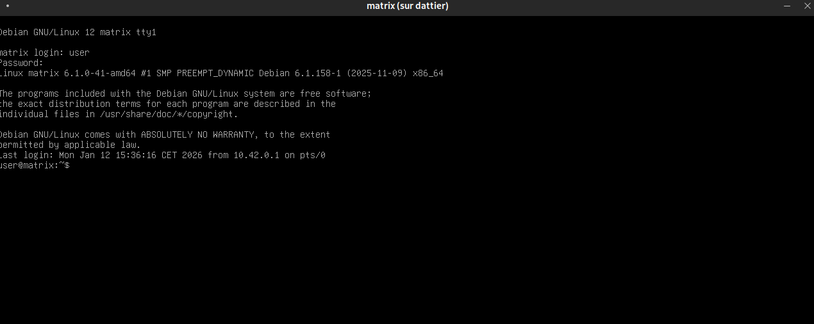

# Connexion SSH au terminal de la VM

Une fois que la machine virtuelle est demarrée, nous avons 2 possibilités de se connecter à la machine virtuelle.

Se connecter à la VM, nous permettra de configurer par la suite le réseau, les outils nécessaires ainsi que l'instance de Matrix.

## 🔳 Console virtuelle (fenêtre graphique)
La console virtuelle est une **application graphique**. Si vous êtes connecté à distance à `dattier.iutinfo.fr`, il faut autoriser la redirection X11.

Depuis votre machine physique, reconnectez-vous à la machine de virtualisation avec :

```bash
ssh -X dattier.iutinfo.fr
```

Ainsi, nous pouvons accéder au terminal de la machine virtuelle via fenêtre graphique:

```bash
vmiut show matrix
```

Vous verrez l'écran de la VM. Connectez-vous avec l'utilisateur `user` (mot de passe `user`) ou `root` (mot de passe `root`) pour être administrateur.
<p align="center">
  
</p>

## 📟 Connexion SSH classique
Nous pouvons également nous connecter à la machine virtuelle avec `ssh`.

Par défaut, la machine virtuelle a une adresse IP locale fournie via DHCP. C'est un détail important puisque nous allons par la suite modifier la **configuration réseau** de la machine virtuelle, où nous allons changer l'IP générée par défaut par une IP statique dans notre plage d'adresses allouée.

Une fois la machine virtuelle démarrée, nous pouvons voir son IP avec `vmiut info` (par exemple `10.42.8.174`).

Une fois que nous avons l'adresse IP, nous pouvons nous connecter via `ssh`, à l'utilisateur standard `user` et comme mot de passe `user`:
```bash
ssh user@10.42.8.174
```

---

- Page précédente: [Création et gestion d’une machine virtuelle](creationvm.md)
- Page suivante: [Configuration réseau](configurationreseau.md)
